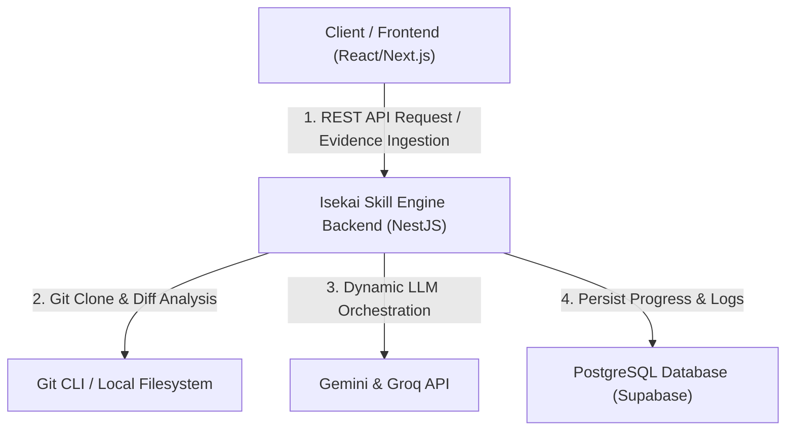

# 🔮 Isekai Skill Engine Backend

[](https://nestjs.com/)
[](https://www.typescriptlang.org/)
[](https://www.postgresql.org/)
[](https://www.docker.com/)

**Isekai Skill Engine Backend** adalah engine pemrosesan bukti pembelajaran (*learning evidence processor*) berbasis event-driven yang mengkonversi aktivitas Git dan bukti belajar menjadi data terstruktur yang siap diumpankan ke AI (structured AI-ready input data). Proyek ini berfungsi sebagai **pusat pemrosesan (core backend)** yang berpasangan dengan repositori frontend Anda:

🔗 **[isekai-skill-front-end](https://github.com/faizulmushofa/isekai-skill-front-end)**

Dengan mengotomatiskan analisis bukti belajar, kuis, dan repositori kode, arsitektur ini memetakan pertumbuhan kompetensi keahlian pengguna secara real-time dan menyajikannya secara dinamis ke sisi klien.

---

## 🏗️ Arsitektur Hubungan Sistem

Berikut adalah alur integrasi pemrosesan evidence dalam Isekai Skill Engine:



---

## ⚡ Fitur Utama

- 🐙 **Git Core Parser**: Mengklon repositori Git secara asinkron (*shallow clone*), melakukan fetch pembaruan, dan mendeteksi perubahan berkas secara incremental berbasis git diff untuk mendeteksi keahlian coding secara heuristik.
- 🤖 **AI Orchestration**: Dynamic model routing ke penyedia AI (Gemini / Groq) lengkap dengan validasi skema keluaran terstruktur (Zod) dan penanganan kegagalan (*fallback mechanisms*).
- 🌳 **Hierarchical Skill Engine**: Pemetaan progres keahlian berbasis parent-child secara deterministik maupun dinamis dari hasil analisis AI.
- 📝 **Evidence Ingestion**: Mendukung pengunggahan jurnal teks bebas dan ekstraksi dokumen bukti belajar PDF/TXT secara otomatis.
- 🧩 **Quiz State Machine**: Sistem kuis berbasis topik yang diatur oleh modul CQRS (Command Query Responsibility Segregation) dengan evaluasi jawaban oleh AI.
- 🔐 **WebAuthn Passkey Security**: Keamanan super ketat untuk dashboard infrastruktur menggunakan otentikasi biometrik/hardware (Passkey) yang dikunci permanen setelah registrasi pertama.
- 📧 **Email OTP & Auto-Rollback**: Pendaftaran akun dilindungi kode verifikasi OTP 6-digit lewat Brevo SMTP API dengan proteksi pembatalan (*rollback*) database jika pengiriman email gagal.
- 🚦 **Token & Action Quota Tracker**: Pembatasan kuota eksekusi (PROJECT, JOURNAL, QUIZ) pengguna serta pelacakan konsumsi token AI harian/bulanan di database untuk mencegah kebocoran biaya API.

---

## 🚀 Penggunaan Cepat dengan Docker

Layanan ini dapat dijalankan menggunakan image Docker resmi yang telah dikonfigurasi untuk produksi.

```bash
docker run -d \
  --name isekai-skill-engine \
  -p 3090:3090 \
  --env-file .env \
  -v /path/to/local/data:/app/data \
  isekai-skill-engine-backend:latest
```

> [!NOTE]  
> Folder volume `/app/data` digunakan untuk menyimpan workspace repositori Git yang diunduh dan diproses secara lokal oleh backend.

---

## ⚙️ Variabel Lingkungan & Konfigurasi (NestJS & Docker)

Konfigurasi aplikasi sepenuhnya dimuat melalui Environment Variable berikut:

| Environment Variable | Default | Deskripsi |
| :--- | :--- | :--- |
| `DATABASE_URL` | *Wajib Diisi* | URI koneksi PostgreSQL (Supabase). Tambahkan `?pgbouncer=true` jika menggunakan port 6543. |
| `JWT_ACCESS_SECRET` | *Wajib Diisi* | Kunci rahasia penandatanganan JWT Access Token. |
| `JWT_REFRESH_SECRET` | *Wajib Diisi* | Kunci rahasia penandatanganan JWT Refresh Token. |
| `JWT_EXPIRES_IN` | `15m` | Masa aktif JWT Access Token. |
| `JWT_REFRESH_EXPIRES_IN` | `7d` | Masa aktif JWT Refresh Token. |
| `BREVO_API_KEY` | *Wajib Diisi* | API Key dari Brevo untuk pengiriman email OTP. |
| `MAIL_SENDER_EMAIL` | `noreply@aethersystem.com` | Alamat email pengirim OTP. |
| `MAIL_SENDER_NAME` | `Aether Gateway` | Nama pengirim email OTP. |
| `PORT` | `3090` | Port server aplikasi backend NestJS. |
| `FRONTEND_URL` | `http://localhost:3000` | URL aplikasi web utama (CORS). |
| `ADMIN_FRONTEND_URL` | `http://localhost:3001` | URL aplikasi web admin (CORS). |
| `INFRA_SECRET_KEY` | *Wajib Diisi* | Kunci rahasia otentikasi inisiasi administrasi infrastruktur. |

---

## 📜 Kontrak Layanan & Cara Penggunaan (REST API Contract)

### 1. Endpoint Utama

#### 🔑 **Autentikasi (`/auth`)**
* `POST /auth/register` - Pendaftaran akun baru & pengiriman OTP.
* `POST /auth/verify-otp` - Verifikasi kode OTP email.
* `POST /auth/login` - Login, pemberian JWT token & cookie.
* `POST /auth/logout` - Logout & penghapusan sesi.

#### 📂 **Projects (`/projects`)**
* `POST /projects` - Mendaftarkan pelacakan repositori proyek.
* `POST /projects/:id/orchestrate` - Memicu kloning, analisis perubahan file git diff, dan kalkulasi AI.

#### ✍️ **Journals (`/journals`)**
* `POST /journals` - Unggah jurnal berbasis teks.
* `POST /journals/upload` - Ekstraksi dokumen bukti belajar PDF/TXT.

#### 🧠 **Quiz (`/quiz`)**
* `POST /quiz/start` - Memulai sesi kuis baru berdasarkan topik.
* `POST /quiz/answer` - Menyerahkan jawaban pertanyaan kuis saat ini.

---

### 2. Cara Integrasi Klien (Contoh Request Orkestrasi Git)

Berikut adalah contoh pemanggilan API menggunakan JavaScript/Node.js untuk memicu orkestrasi scanning Git repositori:

```javascript
const projectId = 'uuid-project-12345';
const token = 'YOUR_JWT_ACCESS_TOKEN';

fetch(`http://localhost:3090/projects/${projectId}/orchestrate`, {
  method: 'POST',
  headers: {
    'Authorization': `Bearer ${token}`,
    'Content-Type': 'application/json'
  }
})
.then(response => response.json())
.then(data => {
  console.log('Hasil Orkestrasi Keahlian:', data);
})
.catch(error => {
  console.error('Gagal memicu orkestrasi:', error);
});
```

---

## 🛠️ Langkah Menjalankan Secara Lokal (Development)

### Prasyarat
- Node.js v20 atau versi yang lebih baru
- Git CLI terpasang di sistem operasi
- Database PostgreSQL/Supabase aktif

### 1. Clone & Install Dependensi
```bash
git clone https://github.com/faizulmushofa/isekai-skill-engine-backend.git
cd isekai-skill-engine-backend
npm install
```


### 2. Jalankan Migrasi Database & Seeding
```bash
npx prisma db push
npx prisma db seed
```

### 3. Jalankan Aplikasi Secara Lokal
```bash
npm run start:dev
```

---

## 🧑💻 Penulis
* **Faizul Mushofa** - [faizulmushofa](https://github.com/faizulmushofa)
