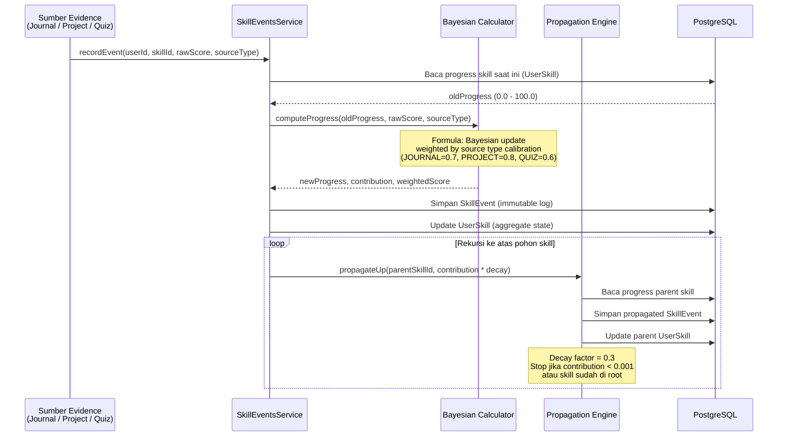

# Alur Sistem Isekai Skill Engine — AI Flow Diagram

## 🗺️ Diagram Utama: Seluruh Alur Fitur Berbasis AI

```mermaid
flowchart TD
    %% ══════════════════════════════════════════════════════
    %% LAYER 1: PENGGUNA & FRONTEND
    %% ══════════════════════════════════════════════════════
    User(["👤 Pengguna"])

    subgraph FE ["🖥️ Frontend — Next.js"]
        direction TB
        F_Auth["Halaman Login / Register"]
        F_Onboard["Halaman Onboarding\n(RIASEC Survey)"]
        F_Dashboard["Dashboard\n(Progres Karir & Skill)"]
        F_Journal["Halaman Journals\n(Tulis / Upload PDF)"]
        F_Project["Halaman Projects\n(Hubungkan Repo Git)"]
        F_Quiz["Halaman Quiz Arena\n(Kuis Adaptif AI)"]
        F_Skills["Halaman Skill Tree\n(Konstelasi & Progres)"]
    end

    User --> F_Auth
    User --> F_Journal
    User --> F_Project
    User --> F_Quiz
    User --> F_Onboard

    %% ══════════════════════════════════════════════════════
    %% LAYER 2: BACKEND NESTJS
    %% ══════════════════════════════════════════════════════
    subgraph BE ["⚙️ Backend — NestJS"]
        direction TB

        %% ─── Auth Flow ────────────────────────────────────
        subgraph AUTH ["🔑 Auth Module"]
            A_Register["POST /auth/register\n(OTP via Brevo SMTP)"]
            A_Login["POST /auth/login\n(JWT + HttpOnly Cookie)"]
        end

        %% ─── Onboarding Flow ──────────────────────────────
        subgraph ONBOARD ["🧭 Onboarding / Career Goal Module"]
            O_RIASEC["POST /career-goals/init\n(Submit RIASEC answers)"]
            O_Align["🤖 AI: BEHAVIORAL_CAREER_ALIGNMENT\nAnalisis kecocokan kepribadian\n→ rekomendasikan karir terbaik"]
            O_Classify["🤖 AI: SKILL_INIT_CLASSIFICATION\nKlasifikasi skill awal\n→ bangun hierarki skill tree"]
            O_Question["🤖 AI: SKILL_INIT_ADAPTIVE_QUESTION\nGenerate pertanyaan adaptif\nuntuk kalibrasi level awal"]
            O_Explain["🤖 AI: SKILL_INIT_SKILLS_EXPLANATOR\nBuat penjelasan skill\nuntuk ditampilkan ke pengguna"]
            O_Taxonomy["🤖 AI: SKILL_TAXONOMY_RESOLVER\nResolve & deduplikasi\nnode skill dalam graph"]
        end

        %% ─── Journal Flow ─────────────────────────────────
        subgraph JOURNAL ["📝 Journal Module"]
            J_Create["POST /journals\n(teks manual)"]
            J_Upload["POST /journals/upload\n(PDF / TXT)"]
            J_Extract["ExtractionService\n(PDF Parser / Text Normalizer)"]
            J_AI["🤖 AI: LEARNING_EVIDENCE\nEkstrak skill yang dipelajari\n→ mapping ke parent skill aktif"]
            J_GetDetail["GET /journals/:id\n(+ daftar SkillEvent & XP)"]
        end

        %% ─── Project Flow ─────────────────────────────────
        subgraph PROJECT ["🐙 Project Module"]
            P_Register["POST /projects\n(daftarkan URL repo Git)"]
            P_Orchestrate["POST /projects/:id/orchestrate"]
            P_GitClone["Git CLI\n(shallow clone / fetch update)"]
            P_GitDiff["Git Diff Parser\n(deteksi file berubah)"]
            P_AI["🤖 AI: PROJECT_EVIDENCE\nAnalisis perubahan kode\n→ deteksi skill teknikal coding"]
        end

        %% ─── Quiz Flow ────────────────────────────────────
        subgraph QUIZ ["🧠 Quiz Module"]
            Q_Start["POST /quiz/start\n(pilih topik skill)"]
            Q_Generate["🤖 AI: ASSESSMENT_GENERATOR\nGenerate batch soal esai\nberbasis topik & tingkat XP"]
            Q_Answer["POST /quiz/answer\n(kirim jawaban)"]
            Q_Evaluate["🤖 AI: QUIZ_BATCH_EVALUATION\nEvaluasi jawaban esai\n→ beri skor & feedback"]
            Q_History["GET /quiz/history\n(riwayat + XP perolehan)"]
        end

        %% ─── Skill Event & Progression Engine ────────────
        subgraph ENGINE ["🌳 Skill Progression Engine"]
            SE_Record["SkillEventsService\n.recordEvent()"]
            SE_Bayesian["Bayesian Progression Calculator\n(computeProgress)"]
            SE_Propagate["Recursive Parent Propagation\n(XP decay ke ancestor)"]
            SE_UserSkill["Update UserSkill\n(aggregate progress state)"]
        end

        %% ─── AI Infrastructure ────────────────────────────
        subgraph AI_INFRA ["🤖 AI Infrastructure Layer"]
            AI_Router["Dynamic AI Router\n(DynamicRoutingService)"]
            AI_Groq["Groq API\n(Primary / Fallback)"]
            AI_Gemini["Gemini API\n(Primary / Fallback)"]
            AI_Quota["Quota & Token Tracker\n(cegah kebocoran biaya API)"]
            AI_Schema["Zod Schema Validation\n(structured JSON output)"]
        end
    end

    %% ─── Database ─────────────────────────────────────────
    DB[("🗄️ PostgreSQL\nSupabase")]

    %% ══════════════════════════════════════════════════════
    %% KONEKSI ALUR AUTH
    %% ══════════════════════════════════════════════════════
    F_Auth --> A_Register
    F_Auth --> A_Login
    A_Register --> DB
    A_Login --> DB

    %% ══════════════════════════════════════════════════════
    %% KONEKSI ALUR ONBOARDING
    %% ══════════════════════════════════════════════════════
    F_Onboard --> O_RIASEC
    O_RIASEC --> O_Align
    O_Align --> AI_Router
    O_RIASEC --> O_Classify
    O_Classify --> AI_Router
    O_RIASEC --> O_Question
    O_Question --> AI_Router
    O_RIASEC --> O_Explain
    O_Explain --> AI_Router
    O_Classify --> O_Taxonomy
    O_Taxonomy --> AI_Router
    O_RIASEC --> DB

    %% ══════════════════════════════════════════════════════
    %% KONEKSI ALUR JOURNAL
    %% ══════════════════════════════════════════════════════
    F_Journal --> J_Create
    F_Journal --> J_Upload
    J_Upload --> J_Extract
    J_Extract --> J_AI
    J_Create --> J_AI
    J_AI --> AI_Router
    J_AI --> SE_Record
    F_Journal --> J_GetDetail
    J_GetDetail --> DB

    %% ══════════════════════════════════════════════════════
    %% KONEKSI ALUR PROJECT
    %% ══════════════════════════════════════════════════════
    F_Project --> P_Register
    P_Register --> DB
    F_Project --> P_Orchestrate
    P_Orchestrate --> P_GitClone
    P_GitClone --> P_GitDiff
    P_GitDiff --> P_AI
    P_AI --> AI_Router
    P_AI --> SE_Record

    %% ══════════════════════════════════════════════════════
    %% KONEKSI ALUR QUIZ
    %% ══════════════════════════════════════════════════════
    F_Quiz --> Q_Start
    Q_Start --> Q_Generate
    Q_Generate --> AI_Router
    Q_Generate --> DB
    F_Quiz --> Q_Answer
    Q_Answer --> Q_Evaluate
    Q_Evaluate --> AI_Router
    Q_Evaluate --> SE_Record
    F_Quiz --> Q_History
    Q_History --> DB

    %% ══════════════════════════════════════════════════════
    %% KONEKSI SKILL PROGRESSION ENGINE
    %% ══════════════════════════════════════════════════════
    SE_Record --> SE_Bayesian
    SE_Bayesian --> SE_Propagate
    SE_Propagate --> SE_UserSkill
    SE_UserSkill --> DB
    SE_Record --> DB

    %% ══════════════════════════════════════════════════════
    %% KONEKSI AI INFRASTRUCTURE
    %% ══════════════════════════════════════════════════════
    AI_Router --> AI_Quota
    AI_Quota --> AI_Groq
    AI_Quota --> AI_Gemini
    AI_Groq --> AI_Schema
    AI_Gemini --> AI_Schema
    AI_Schema --> DB

    %% ══════════════════════════════════════════════════════
    %% DASHBOARD BACA DATA
    %% ══════════════════════════════════════════════════════
    F_Dashboard --> DB
    F_Skills --> DB

    %% ══════════════════════════════════════════════════════
    %% STYLE
    %% ══════════════════════════════════════════════════════
    classDef aiNode fill:#7c3aed,color:#fff,stroke:#5b21b6,stroke-width:2px
    classDef userNode fill:#0ea5e9,color:#fff,stroke:#0284c7,stroke-width:2px
    classDef dbNode fill:#16a34a,color:#fff,stroke:#15803d,stroke-width:2px
    classDef feNode fill:#f59e0b,color:#fff,stroke:#d97706,stroke-width:1px
    classDef engineNode fill:#dc2626,color:#fff,stroke:#b91c1c,stroke-width:2px

    class J_AI,P_AI,Q_Generate,Q_Evaluate,O_Align,O_Classify,O_Question,O_Explain,O_Taxonomy aiNode
    class User userNode
    class DB dbNode
    class ENGINE,SE_Record,SE_Bayesian,SE_Propagate,SE_UserSkill engineNode
```

---

## 🤖 Tabel Model AI per Fitur

| Modul / Tugas | Primary Model | Fallback Model | Karakteristik |
|:---|:---|:---|:---|
| **LEARNING_EVIDENCE** | Groq `llama-3.3-70b-versatile` | Gemini `gemini-1.5-flash` | Ekstraksi skill dari teks jurnal, mapping ke parent skill |
| **ASSESSMENT_GENERATOR** | Gemini `gemini-1.5-pro` | Groq `mixtral-8x7b-32768` | Generate soal esai analitis tingkat tinggi |
| **PROJECT_EVIDENCE** | Groq `deepseek-r1-distill-llama-70b` | Gemini `gemini-1.5-flash-8b` | Analisis git diff & deteksi skill coding |
| **BEHAVIORAL_CAREER_ALIGNMENT** | Groq `gemma2-9b-it` | Gemini `gemini-2.0-flash` | Analisis kepribadian RIASEC → rekomendasi karir |
| **SKILL_INIT_CLASSIFICATION** | Gemini `gemini-1.5-pro` | Groq `mixtral-8x7b-32768` | Klasifikasi & inisiasi skill tree awal pengguna |
| **SKILL_INIT_ADAPTIVE_QUESTION** | Groq `llama-3.1-8b-instant` | Gemini `gemini-1.5-pro` | Generate pertanyaan kalibrasi level awal |
| **SKILL_INIT_SKILLS_EXPLANATOR** | Gemini `gemini-1.5-flash-8b` | Groq `llama-3.3-70b-versatile` | Buat deskripsi skill yang mudah dipahami |
| **SKILL_TAXONOMY_RESOLVER** | Gemini `gemini-2.0-flash` | Groq `gemma2-9b-it` | Resolve & deduplikasi node skill dalam graph |
| **QUIZ_BATCH_EVALUATION** | Groq `mixtral-8x7b-32768` | Gemini `gemini-2.0-pro-exp` | Evaluasi jawaban esai pengguna & beri skor |

---

## 🌳 Alur Skill Progression Engine (Detail)

